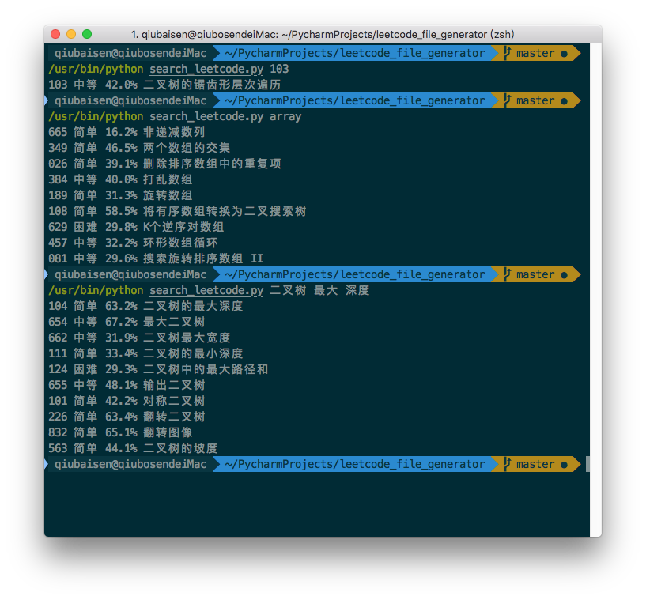
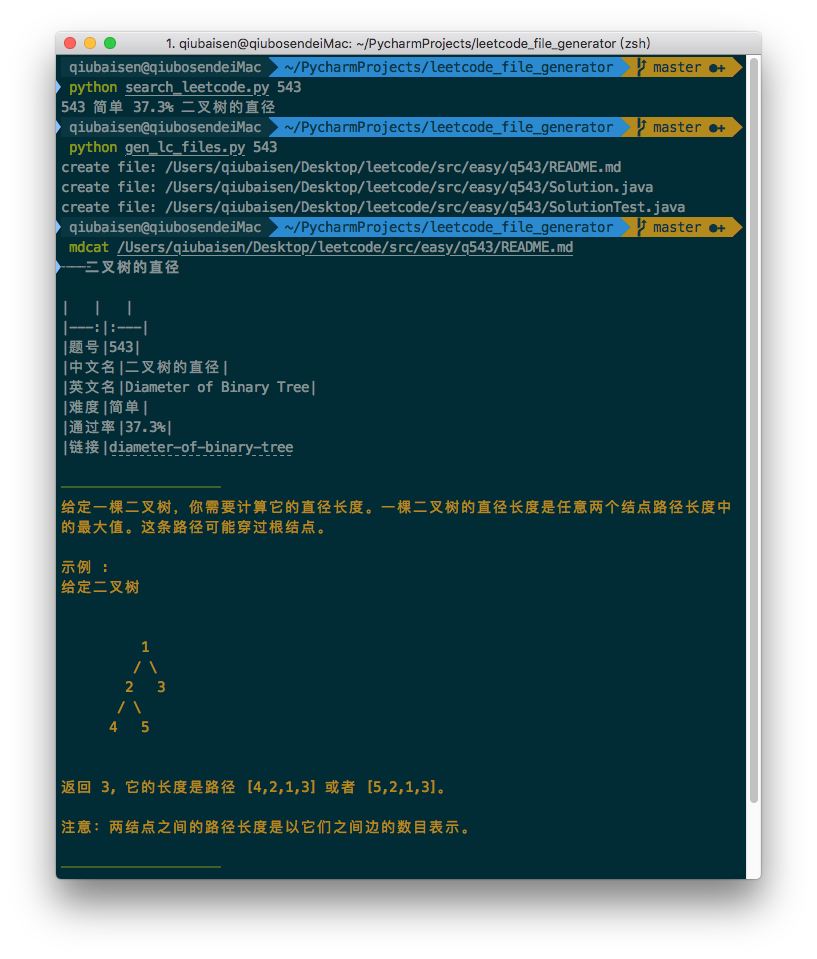

# leetcode 文件生成器
[English](README.md)

一个简单的工具用来快速生成 `leetcode` 学习所需要的文件

### 使用方式:
```
1. 编辑 `settings.py` 并设置 `src_path` 到目标目录
src_path = "your/source/path"

2. 运行 `search_leetcode.py` 搜索关键字
python search_leetcode.py [keyword]

3. 给定一个题号，运行 `gen_files.py` 生成文件
python gen_files.py [qid]
``` 
### 注意:
1. python version: `2.7`
2. 部分操作是基于本地数据 `dumps.txt`
3. 当前仅支持 `leetcode-cn.com`, 如果需要对 `leetcode.com` 进行支持，可以提交 `issue` 或者 `pull request`

### 如何更新数据集 `dumps.txt`
有两个相关文件: `html_parser.py` 和 `default.html`
1. 打开网页 `https://leetcode-cn.com/problemset/all/`
2. 打开浏览器的开发者工具，使用元素选择器选中题目表格。选择器路径为：`#question-app > ... > table > tbody.reactable-data`
3. 在目标 `tbody` 元素上右键，选中 `edit as HTML`, 然后复制内容，新建html文件，比如: `lc-2018-08.html`
4. 使用 `html_parser.py` 解析html文件， 并更新 `dumps.txt`
```bash
python html_parser.py lc-2018-08.html
```

### 其他:
此工具已经集成到了 [Alfred](https://www.alfredapp.com) workflow

链接地址: [Find Leetcode](https://github.com/qbosen/Alfred-WorkFlow/tree/master/FindLeetCode)

### 图片:
1. 搜索功能:

2. 生成文件

