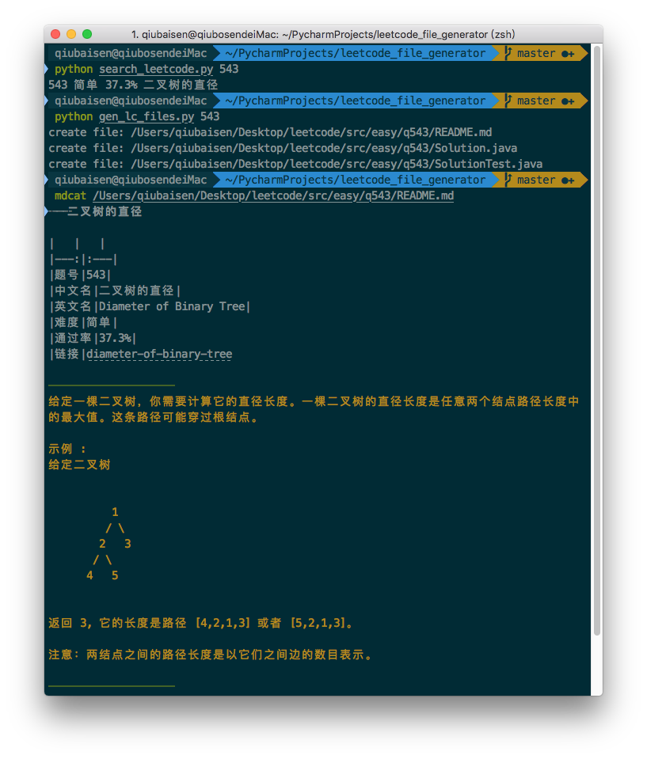

# Leetcode Files Generator
[中文](README-zh.md)

Simple tools to generate leetcode exercises files conveniently 

### Usage:
```
1. edit `settings.py` and set `src_path` to your source path
src_path = "your/source/path"

2. run `search_leetcode.py` to search `keyword`
python search_leetcode.py [keyword]

3. run `gen_files.py` by giving specified leetcode question id
python gen_files.py {qid}
``` 

### Advanced options:
1. Create solution method declaration automatic 
2. Can customize question description's style. Convert `html` tags to `markdown` 
3. Build-in `10` kinds of formats `0...9`. The larger number, the fewer `html`
4. Write the test case data in your test code
5. Insert the image from question description to your `README.md`
6. Get question's `topic`
7. Support more languages

Set `enable_advance=True` in `settings_advanced.py` to enable these options
```
format can be ignored
python gen_files.py {qid} [format]
```

### Note:
1. python version: `2.7`
2. some operations are based on the local data `dumps.txt`
3. all codes are based on `leetcode-cn.com`, 
if `leetcode.com` version is required, you can commit `issue` or `pull request`
* Advanced options：
1. Format value: `0-9`, default value is `8` if no input detected,
The larger number, the fewer `html`, Contrasts reference [format contrast](Formats.md)
2. Customize question description's style by invoking methods in html2md.Html2md() continuously.
This needs to edit codes.
3. The default language is `java`, you can change `language` setting refer to `language_map`,
at the same time, you need to edit the `pattern`s to support comment style， namespace, template codes, etc..

### How to update `dumps.txt`
Use `gen_table_readme.py` to update dumps file or generate readme file.

* update resources of `leetcode` which use to accelerate searching speed:
```bash
python gen_table_readme.py update_dumps
```
* generate `question table` according to packages under `src_path`
```bash
python gen_table_readme.py update_readme
```

### Others:
The tool is integrated in [Alfred](https://www.alfredapp.com) workflow

Project Link: [Find Leetcode](https://github.com/qbosen/Alfred-WorkFlow/tree/master/FindLeetCode)


### Pictures:
1. Searching questions:

2. Generate files

